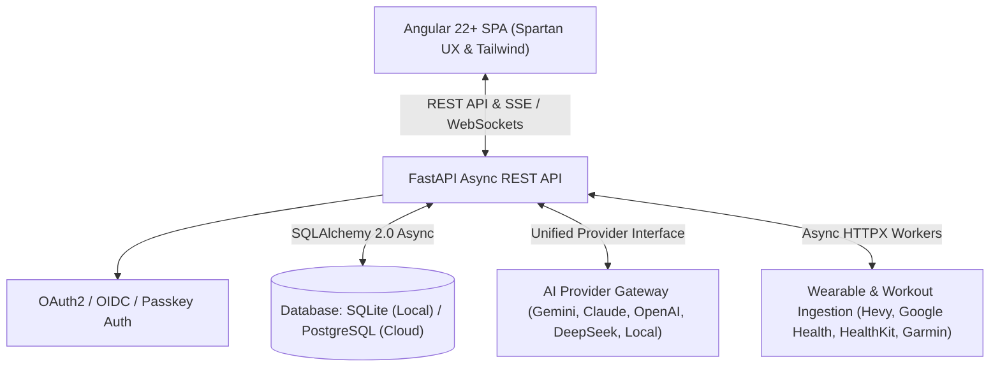

# Technology Evaluation & Master Roadmap: Workout Agent

> **Mission:** A modern, unconstrained, multi-user fitness intelligence platform combining an **Angular (Spartan UX & Tailwind CSS)** frontend with a high-performance **FastAPI (Python 3.12+)** backend, supporting any AI provider, wearable connector, and database engine.

---

## 1. Tool, Package & Technology Evaluation (Recommendations & Swaps)

| Layer | Current Tooling | Recommended Upgrades & Swaps | Benefits & Rationale |
| :--- | :--- | :--- | :--- |
| **Frontend Framework** | Angular 22 standalone components & signals | Continue Angular 22+ with `httpResource` & zoneless change detection | Blazing fast rendering, clean reactive signals, full SSR/SSG & PWA readiness. |
| **UI Primitives & Styling** | Spartan UX (`@spartan-ng/brain` + `@spartan-ng/ui`) + Tailwind CSS v3.4 | Upgrade to **Tailwind CSS v4** + Spartan UI | Zero-config CSS build, instant Vite compilation, unified design tokens for Claude Code Design. |
| **Visualizations & Charts** | Server-rendered SVG strings via `[innerHTML]` | **ApexCharts / ECharts / Chart.js** (`ng-apexcharts` or `ngx-echarts`) + SVG fallback | Adds fluid zoom, touch-friendly hover tooltips, smooth time-series animations, and client-side theme switching. |
| **Icons & Assets** | `@ng-icons/lucide` | Retain `@ng-icons/lucide` | Tree-shakeable, modern, consistent icons matching Spartan / shadcn design language. |
| **Backend Framework** | FastAPI + Pydantic v2 | Keep **FastAPI** + **Pydantic v2** | High-throughput asynchronous endpoints with auto-generated OpenAPI documentation. |
| **Database & ORM** | Raw `sqlite3` queries with manual schema migrations | **SQLAlchemy 2.0 (async)** or **SQLModel** + **Alembic** | Type-safe query building, automated migrations, zero friction to toggle between **SQLite (WAL)** and **PostgreSQL (asyncpg)**. |
| **Async HTTP Client** | Mixed `requests` and `httpx` | Standardize 100% on **HTTPX (async)** | Non-blocking network I/O for all external calls (Hevy, Google Health, Telegram, AI APIs). |
| **AI Provider SDKs** | `google-generativeai`, `openai`, `anthropic` | Upgrade to modern **`google-genai` SDK**, plus `openai` & `anthropic` + **Ollama / LiteLLM** | Universal provider gateway: Gemini 2.5 Flash, Claude 3.7 / 3.5 Sonnet, GPT-4o, DeepSeek-V3/R1, and local offline models. |
| **Authentication & Auth** | Google OAuth via Authlib + Session cookies | **FastAPI-Users / Authlib** with Multi-Provider OAuth + JWT/Passkeys | Adds GitHub, Apple, Google, and passwordless magic links with granular user session management. |
| **Task Scheduling** | `scheduler.py` loop | **APScheduler 4 (AsyncIO)** or **ARQ / Redis Queue** | Robust per-user cron jobs, retry logic, rate-limiting, and webhook-driven ingestion. |
| **Testing & Quality** | `pytest`, `ruff`, `mypy`, `vitest` | `pytest-asyncio` + `vitest` + **Playwright E2E** | Hermetic API unit tests, reactive component tests, and browser user-flow verification. |

---

## 2. Architectural Blueprint & Unconstrained Roadmap

---

## 3. Unconstrained Action Plan

### Phase 1: Full Multi-Tenancy & Modern ORM
- [ ] Complete multi-tenancy migrations for all database tables (`hevy_routines`, `hevy_meta`, `programme_state`, `user_preferences`).
- [ ] Implement SQLAlchemy 2.0 / SQLModel layer with dual SQLite and PostgreSQL support.
- [ ] Ensure all API endpoints return clean, typed Pydantic models.

### Phase 2: Spartan UX & Client-Side Interactivity
- [ ] Apply Spartan UI primitives across all views (`/dashboard`, `/plan`, `/history`, `/progress`, `/stats`, `/chat`, `/settings`, `/checkins`).
- [ ] Integrate modern interactive charts (ApexCharts / ECharts) with dark-mode theme synchronization.
- [ ] Implement responsive bottom navigation for mobile PWA experience.

### Phase 3: Multi-Provider AI & Wearable Connectors
- [ ] Upgrade AI engine to support streaming completions, custom prompt profiles, and multi-model reasoning.
- [ ] Expand wearable integration: Hevy API v1, Google Health Connect, Apple HealthKit export parser, and Garmin.
- [ ] Implement per-user encrypted API key manager with live connection testing.

### Phase 4: Async Job Orchestration & Production Deployment
- [ ] Migrate scheduler to native async scheduling for per-user daily briefings and background sync.
- [ ] Provide unified Docker Compose orchestration with automated frontend compilation and reverse-proxy deployment.

